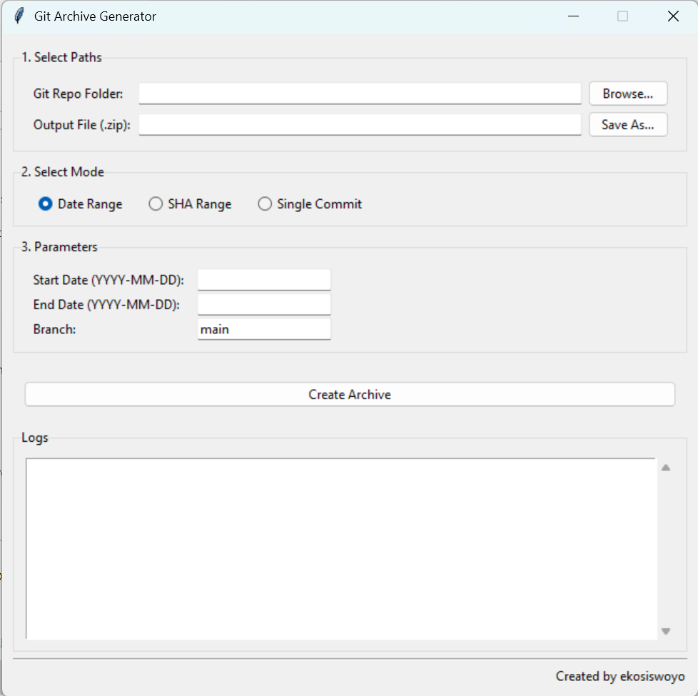

# Git Archive Generator

A user-friendly tool, available in both GUI and CLI versions, to archive files from a Git repository based on commit history over a specific date range, commit range, or from a single commit.

This tool creates a `.zip` file containing the specified files and a `.txt` changelog detailing the contents.



## Features

- **Graphical User Interface (GUI):** An easy-to-use interface for non-technical users.
- **Command-Line Interface (CLI):** A powerful and scriptable interface for developers.
- **Multiple Selection Modes:**
  - **Date Range:** Archive all changes on a specific branch within a start and end date.
  - **SHA Range:** Archive all changes between two specific commit SHAs.
  - **Single Commit:** Archive only the files that were modified in one specific commit.
- **Dual Output:**
  - Creates a `.zip` archive with the full directory structure preserved.
  - Creates a `.txt` changelog file listing all included files and the range criteria.
- **Portable Executable:** Packaged as a standalone `.exe` that runs on Windows without needing Python installed.

---

## How to Use (for End-Users)

1.  Go to the [**Releases**](https://github.com/ekosiswoyo/getLogGit/releases) page of this repository.
2.  Download the latest `.exe` file (`git_archive_ui.exe` for the graphical version is recommended).
3.  Double-click `git_archive_ui.exe` to run the application.
4.  Follow the on-screen instructions:
    -   Browse for your local Git repository folder.
    -   Choose where to save the output `.zip` file.
    -   Select your desired mode (Date, SHA Range, or Single Commit).
    -   Fill in the parameters.
    -   Click "Create Archive".

---

## How to Run from Source (for Developers)

If you want to run or modify the source code directly.

**Prerequisites:**
- [Git](https://git-scm.com/)
- [Python 3](https://www.python.org/)

**Instructions:**

1.  **Clone the repository:**
    ```bash
    git clone https://github.com/ekosiswoyo/getLogGit.git
    cd your-repo-name
    ```

2.  **Run the GUI version:**
    ```bash
    python git_archive_ui.py
    ```

3.  **Run the CLI version:**
    ```bash
    # See all options
    python git_archive_by_date.py --help

    # Example: by single commit
    python git_archive_by_date.py "C:\path\to\your\repo" -o my_archive --commit-sha <your_sha>

    # Example: by multi sha
    python git_archive_by_date.py "C:\path\to\your\repo" -o my_archive --start-sha <your_start_sha> --end-sha <your_end_sha>

    # Example: by date    
    python git_archive_by_date.py "C:\path\to\your\repo" -o my_archive --branch <branch_name> --start-date <start_date> --end-date <end_date>
    
    ```

### Building the Executable from Source

To create the `.exe` files yourself:

1.  **Install PyInstaller:**
    ```bash
    pip install pyinstaller
    ```

2.  **Build the GUI executable:**
    ```bash
    pyinstaller --onefile --windowed git_archive_ui.py
    ```

3.  **Build the CLI executable:**
    ```bash
    pyinstaller --onefile git_archive_by_date.py
    ```

4.  The final `.exe` files will be located in the `dist/` folder.

---

## Author

Created by **ekosiswoyo**

