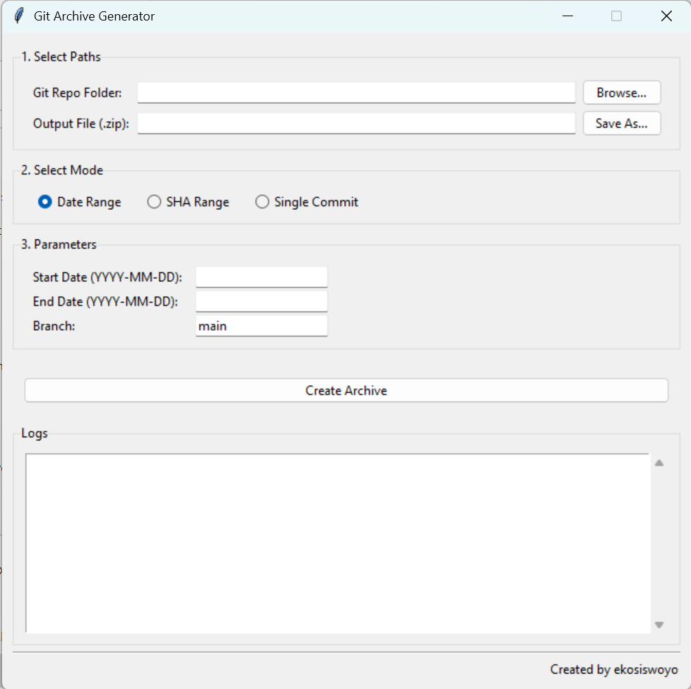

# Git Archive Generator

A user-friendly tool, available in both GUI and CLI versions, to archive files from a Git repository based on commit history over a specific date range, commit range, or from a single commit.

This tool creates a `.zip` file containing the specified files and a `.txt` changelog detailing the contents.



## Features

- **Graphical User Interface (GUI):** An easy-to-use interface for non-technical users.
- **Command-Line Interface (CLI):** A powerful and scriptable interface for developers.
- **Cross-Platform:** Runs on Windows, macOS, and Linux from the source code.
- **Multiple Selection Modes:**
  - **Date Range:** Archive all changes on a specific branch within a start and end date.
  - **SHA Range:** Archive all changes between two specific commit SHAs.
  - **Single Commit:** Archive only the files that were modified in one specific commit.
  - **Tag Range:** Build a release package from the changes between two Git tags.

Date ranges and SHA ranges are inclusive by default: enter the actual first and last date/commit you want to package. In SHA Range mode, check **Exclude start commit** to package C → F as D, E, F. This option applies to preview, archive contents, and changelog and is saved in history. The CLI equivalent is `--exclude-start`.

Use **Copy SHA** next to either SHA range field or in the commit picker to copy an 8-character SHA. On macOS, the interface uses themed controls and system fonts in both themes. Git Pull output opens in a scrollable dialog with a fixed OK button.
- **Persistent History:** Successful archive requests are saved in the user data directory (on macOS: `~/Library/Application Support/GitArchiveGenerator/history.json`), independent of the launch folder. Legacy history is migrated when available.
- **Repository Dashboard:** See the active branch, remote, latest commit, working-tree state, and ahead/behind counts.
- **Safe Remote Updates:** Fetch with pruning or pull using fast-forward-only mode.
- **Interactive Preview:** Review Added, Modified, Deleted, Renamed, and Copied files and choose which changes to include.
- **Deployment Deletion Manifest:** Every archive containing deletions includes `deleted_files.txt` for removing obsolete files from the target server.
- **Branch and Tag Pickers:** Local/remote branches and tags are loaded from the selected repository.
- **Date Tools:** Built-in calendar plus Today, Last 7 Days, and This Month presets.
- **Exclude Rules:** Semicolon-separated glob patterns keep secrets, dependencies, or generated files out of a package.
- **Dual Output:**
  - Creates a `.zip` archive with the full directory structure preserved.
  - Creates a `.txt` changelog file listing all included files and the range criteria.
- **Portable Executable:** Can be packaged into a standalone executable for easy distribution.

---

## How to Use (for End-Users)

1.  Go to the [**Releases**](https://github.com/ekosiswoyo/getLogGit/releases) page of this repository.
2.  Download the latest `.exe` file (`git_archive_ui.exe` for the graphical version is recommended).
3.  Double-click `git_archive_ui.exe` to run the application.
4.  Follow the on-screen instructions:
    -   Browse for your local Git repository folder.
    -   Choose where to save the output `.zip` file.
    -   Select your desired mode (Date, SHA Range, or Single Commit).
    -   Fill in the parameters.
    -   Click "Create Archive".

---

## How to Run from Source (for Developers)

If you want to run or modify the source code directly.

**Prerequisites:**
- [Git](https://git-scm.com/)
- [Python 3](https://www.python.org/)

**Instructions:**

1.  **Clone the repository:**
    ```bash
    git clone https://github.com/ekosiswoyo/getLogGit.git
    cd your-repo-name
    ```

2.  **Run the GUI version:**
    ```bash
    python git_archive_ui.py
    ```

3.  **Run the CLI version:**
    ```bash
    # See all options
    python git_archive_by_date.py --help

    # Example: by single commit
    python git_archive_by_date.py "C:\path\to\your\repo" -o my_archive --commit-sha <commit_hash>

    # Example: by SHA range
    python git_archive_by_date.py "C:\path\to\your\repo" -o my_archive --start-sha <starting_commit_hash> --end-sha <ending_commit_hash>

    # Example: by date range
    python git_archive_by_date.py "C:\path\to\your\repo" -o my_archive --branch main --start-date YYYY-MM-DD --end-date YYYY-MM-DD

    # Example: between releases, with Markdown changelog and exclusions
    python git_archive_by_date.py "C:\path\to\your\repo" -o release --start-tag v1.0 --end-tag v2.0 --changelog-format md --exclude ".env" --exclude "node_modules/*"
    
    ```


### Building Your Own Executable

To create the executable file yourself:

1.  **Install dependencies:**
    ```bash
    pip install pyinstaller
    ```

2.  **Build the executable:**
    *   For Windows (`.exe`):
        ```bash
        # GUI App
        pyinstaller --onefile --windowed git_archive_ui.py
        # CLI App
        pyinstaller --onefile git_archive_by_date.py
        ```
    *   For macOS (`.app`):
        ```bash
        # GUI App
        pyinstaller --onefile --windowed git_archive_ui.py
        # CLI App
        pyinstaller --onefile git_archive_by_date.py
        ```

3.  The final executable will be located in the `dist/` folder.

---

## Author

Created by **ekosiswoyo**

## Repository from HTTPS URL

Choose **Source → HTTPS URL**, paste the HTTPS clone URL, and click **Connect / Update**.
The app downloads Git objects into a bare cache automatically; no manual clone or working tree is needed.
Date range, SHA range (including exclude start), single commit, tags, preview, copy SHA, archives,
and history use the same Git logic as local repositories. Fetch/Pull in URL mode refresh the cache.
History remembers the URL and selection; tokens are never saved in history or Git config.

Authentication options:

- **Personal access token**: works on a fresh laptop with Git installed, without an existing credential helper.
  Enter your username and PAT. For GitHub choose the repository and Contents read permission;
  for GitLab choose `read_repository`. With 2FA, use a PAT instead of your password.
  Organization SSO/administrator approval may also be required.
- **Web login (Git Credential Manager)**: requires [GCM](https://github.com/git-ecosystem/git-credential-manager/releases).
  If unavailable, the dialog explains how to install it or use a PAT. GCM handles browser login/2FA
  and credential storage. Self-hosted GitLab/enterprise servers may require server-side OAuth setup.
- **Existing credentials / Public**: uses installed Git credential helpers, or accesses public repositories anonymously.

PATs are passed only to the Git child process, not command arguments, saved URLs, logs, or config files.
PAT authentication does not save credentials; enter the token again when updating the cache.
HTTPS certificate verification remains enabled. Company repositories require network/VPN access and
trusted company certificates, as with ordinary Git. Git LFS/submodule content is not downloaded automatically.
